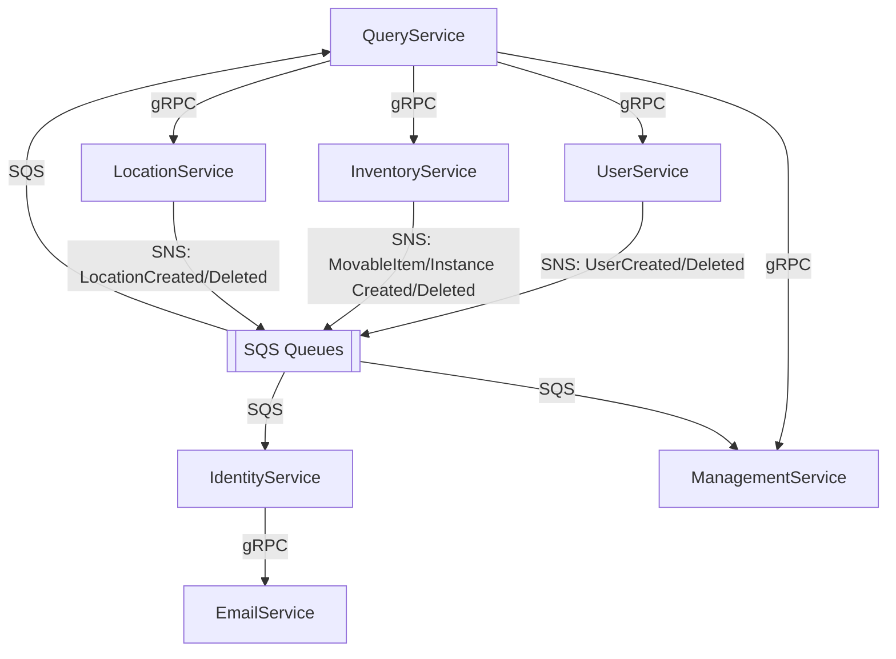

# ItTrAp — Source Services

This directory contains the source code for all microservices that compose the **Item Tracking Application (ItTrAp)** backend. The system is built on **.NET 9** and follows a microservice architecture with event-driven communication and CQRS.

## Architecture Overview

- **CQRS** — Commands and queries are separated via **MediatR 13** with pipeline behaviors for validation and performance logging.
- **Event-Driven Messaging** — **AWS SNS** (fan-out publish) and **AWS SQS** (per-service queues) provide asynchronous, eventually-consistent communication between services.
- **gRPC** — Used for synchronous inter-service queries (most services expose a dual-port Kestrel setup: HTTP/1.1 for REST + HTTP/2 for gRPC).
- **JWT Bearer Authentication** — All services except EmailService require JWT tokens for access control.
- **FluentValidation 12** — Request validation is enforced in the MediatR pipeline.
- **Entity Framework Core 9 + PostgreSQL** — Primary relational store with a snake_case naming convention.
- **Domain-Driven Design** — Rich domain models with aggregates, uniqueness checkers, and factory methods.

---

## Services

### 1. ItTrAp.EmailService

**Aim:** Centralized email-sending gateway for the entire system, exposed exclusively via gRPC.

| Aspect | Details |
|---|---|
| **Transport** | gRPC only (HTTP/2, Kestrel) |
| **Database** | None |
| **Key Libraries** | MailKit, MimeKit, NETCore.MailKit |

**Specifics:**
- Exposes a single gRPC `EmailService` with a `SendEmail` RPC.
- Sends HTML emails over a configurable SMTP relay (MailHog in development).
- Minimal service — no MediatR, no database, no messaging. Pure gRPC server.

---

### 2. ItTrAp.IdentityService

**Aim:** Handles authentication and authorization — sign-in, sign-out, token refresh, and password management. Maintains its own identity records (email, hashed password, roles, and permissions).

| Aspect | Details |
|---|---|
| **Transport** | REST (ASP.NET Core MVC Controllers) |
| **Database** | PostgreSQL (EF Core) |
| **Key Libraries** | MediatR, FluentValidation, System.IdentityModel.Tokens.Jwt |

**Endpoints:**
| Method | Route | Description |
|---|---|---|
| `POST` | `/api/auth/sign-in` | Authenticate user, returns JWT access + refresh tokens |
| `POST` | `/api/auth/sign-out` | Invalidate refresh token |
| `POST` | `/api/auth/refresh-tokens` | Rotate access and refresh tokens |
| `POST` | `/api/auth/{id}/password` | Reset a user's password |

**Domain Model:**
- **User** — Id, Email, PasswordHash, Salt, CreatedAt, Roles
- **Role** — Id, Name, Description, Permissions (many-to-many with User)
- **Permission** — Id, Name, Roles (many-to-many with Role)

**Communication:**
- **Inbound (SQS):** Listens for `UserCreated` / `UserDeleted` events from UserService to create or remove identity records.
- **Outbound (gRPC):** Calls EmailService to send password-related emails.

**Specifics:**
- Password hashing uses pepper + salt.
- Refresh tokens are stored in HttpOnly cookies.
- Identity records are created reactively when `UserCreated` events arrive, ensuring eventual consistency with the UserService.

---

### 3. ItTrAp.InventoryService

**Aim:** Manages the inventory catalog — hierarchical categories, movable items (product/asset definitions), and movable instances (individual physical units). Source of truth for *"what items exist."*

| Aspect | Details |
|---|---|
| **Transport** | REST (Controllers) + gRPC server (HTTP :5003 / gRPC :6003) |
| **Database** | PostgreSQL (Categories, MovableInstances) + MongoDB (MovableItems) |
| **Key Libraries** | MediatR, FluentValidation, MongoDB.Driver, Bogus |

**Endpoints:**
| Method | Route | Description |
|---|---|---|
| `GET/POST/PUT/DELETE` | `/api/v1/categories/...` | Full CRUD for hierarchical category tree |
| `GET/POST/PUT/DELETE` | `/api/v1/movable-items/...` | CRUD for movable item definitions with filtering |
| `GET/POST/DELETE` | `/api/v1/movable-items/{id}/instances/...` | Manage individual instances of an item |

**gRPC RPCs:** `GetMovableItems`, `GetMovableInstancesByItemId`, `GetInstanceAmountsByItemIds`

**Domain Model:**
- **Category** — Tree structure (parent/children) stored in PostgreSQL.
- **MovableItem** — Name, Description, CategoryId, ImgSrc, and flexible `ExtraData` (BsonDocument) stored in MongoDB.
- **MovableInstance** — Individual physical units with a creation timestamp, stored in PostgreSQL.

**Communication:**
- **Outbound (SNS):** Publishes `MovableItemCreated`, `MovableItemDeleted`, `MovableInstanceCreated`, `MovableInstanceDeleted` events.
- **Inbound (gRPC):** Responds to queries from the QueryService.

**Specifics:**
- Hybrid storage: PostgreSQL for relational data + MongoDB for flexible item definitions with arbitrary extra fields.
- `SeedDataJob` populates fake data on startup via Bogus (configurable).
- Domain uniqueness checkers enforce invariants (e.g., unique category names, unique item names).
- Serves static files for uploaded item images.

---

### 4. ItTrAp.LocationService

**Aim:** Manages physical locations with floor and department metadata. Source of truth for *"where things can be."*

| Aspect | Details |
|---|---|
| **Transport** | REST (Controllers) + gRPC server (HTTP :5005 / gRPC :6005) |
| **Database** | PostgreSQL (EF Core) |
| **Key Libraries** | MediatR, FluentValidation, Bogus |

**Endpoints:**
| Method | Route | Description |
|---|---|---|
| `GET` | `/api/v1/locations` | List locations with search and floor filters |
| `GET` | `/api/v1/locations/{id}` | Get location by ID |
| `POST` | `/api/v1/locations` | Create a new location |
| `PUT` | `/api/v1/locations/{id}` | Update a location |
| `DELETE` | `/api/v1/locations/{id}` | Delete a location |

**gRPC RPCs:** `GetLocations`, `GetLocationsByIds`

**Domain Model:**
- **Location** — Id, Floor, Name, Department, CreatedAt (with name uniqueness enforcement).

**Communication:**
- **Outbound (SNS):** Publishes `LocationCreated` / `LocationDeleted` events.
- **Inbound (gRPC):** Responds to queries from the QueryService.

**Specifics:**
- `SeedDataJob` generates fake locations via Bogus on startup.
- Domain uniqueness checker enforces unique location names.

---

### 5. ItTrAp.ManagementService

**Aim:** Core business logic service — manages the **lifecycle and state** of movable instances (booking, assigning, releasing, moving). Tracks which user holds which item and where items are located. This is the *operations* service.

| Aspect | Details |
|---|---|
| **Transport** | REST (Controllers) + gRPC server (HTTP :5004 / gRPC :6004) |
| **Database** | PostgreSQL (EF Core) |
| **Key Libraries** | MediatR, FluentValidation |

**Endpoints:**
| Method | Route | Description |
|---|---|---|
| `GET` | `/api/v1/management/items/{itemId}/instances` | List instances with filters |
| `GET` | `/api/v1/management/items/{itemId}/instances/{id}` | Get instance by ID |
| `PUT` | `/api/v1/management/items/{itemId}/instances/{id}/book` | Book an instance for a user |
| `PUT` | `/api/v1/management/items/{itemId}/instances/{id}/cancel` | Cancel a booking |
| `PUT` | `/api/v1/management/items/{itemId}/instances/{id}/assign` | Assign (take) an instance to a user |
| `PUT` | `/api/v1/management/items/{itemId}/instances/{id}/release` | Release an instance back to a location |
| `PUT` | `/api/v1/management/items/{itemId}/instances/{id}/move` | Move an instance between locations |

**gRPC RPCs:** `GetInstanceAmountInLocations`, `GetInstanceStatusesByItem`, `GetUserStatusesForItems`, `GetItemAmountsByUserIds`, `GetFilteredMovableInstances`

**Domain Model:**
- **MovableInstance** — Rich entity with a status. Linked to a MovableItem, optional Location, and optional User.
- **MovableItem** — Lightweight reference aggregate.
- **Location** — Lightweight reference with a code.
- **User** — Lightweight reference (max 10 instances constraint).
- **MovableInstanceStatus** enum: `Available`, `Booked`, `Taken`.

**Communication:**
- **Inbound (SQS):** Listens for 8 event types — `UserCreated`, `UserDeleted`, `LocationCreated`, `LocationDeleted`, `MovableItemCreated`, `MovableItemDeleted`, `MovableInstanceCreated`, `MovableInstanceDeleted`.
- **Inbound (gRPC):** Responds to queries from the QueryService.

**Specifics:**
- Maintains local lightweight copies of Users, Locations, MovableItems, and MovableInstances created in other services, synchronized via events.
- State machine on `MovableInstance` enforces valid transitions (Book → Take → Release → Move).
- Extracts the current user ID from JWT claims for assignment operations.

---

### 6. ItTrAp.QueryService

**Aim:** Read-optimized query aggregation service (the **"Q" in CQRS**). Composes data from multiple microservices into rich view models for the frontend. Owns no database.

| Aspect | Details |
|---|---|
| **Transport** | REST (Minimal API Endpoints) |
| **Database** | None — stateless aggregator |
| **Key Libraries** | MediatR, FluentValidation, gRPC clients |

**Endpoints:**
| Method | Route | Description |
|---|---|---|
| `GET` | `/api/v1/locations` | Paginated locations with instance count details |
| `GET` | `/api/v1/movable-items` | Paginated items with status/category/location/user filters |
| `GET` | `/api/v1/movable-items/{id}/instances` | Paginated instances for an item with status, location, user info |
| `GET` | `/api/v1/users` | Paginated users with associated instance details |

**gRPC Clients (outbound):**
| Target Service | RPCs Called |
|---|---|
| InventoryService | `GetMovableItems`, `GetMovableInstancesByItemId`, `GetInstanceAmountsByItemIds` |
| LocationService | `GetLocations`, `GetLocationsByIds` |
| ManagementService | `GetInstanceAmountInLocations`, `GetInstanceStatusesByItem`, `GetUserStatusesForItems`, `GetItemAmountsByUserIds`, `GetFilteredMovableInstances` |
| UserService | `GetUsersByIds`, `GetUsers` |

**Communication:**
- **Inbound (SQS):** Subscribes to all domain events for cache/state invalidation.
- **Outbound (gRPC):** Calls all four data-owning services to build composite responses.

**Specifics:**
- Uses Minimal API endpoints instead of MVC controllers.
- All responses are paginated (`PaginatedResponse<T>`).
- Purely a read-side aggregator — no writes, no database.

---

### 7. ItTrAp.UserService

**Aim:** Manages user profiles (personal information). Source of truth for *"who users are"* — name, email, phone, avatar. Distinct from IdentityService, which handles authentication.

| Aspect | Details |
|---|---|
| **Transport** | REST (Controllers) + gRPC server (HTTP :5006 / gRPC :6006) |
| **Database** | PostgreSQL (EF Core) |
| **Key Libraries** | MediatR, FluentValidation, QRCoder, Bogus |

**Endpoints:**
| Method | Route | Description |
|---|---|---|
| `GET` | `/api/v1/users` | List users with search and top filters |
| `GET` | `/api/v1/users/{id}` | Get user by ID |
| `POST` | `/api/v1/users` | Create a new user |
| `PUT` | `/api/v1/users/{id}` | Update a user |
| `DELETE` | `/api/v1/users/{id}` | Delete a user |

**gRPC RPCs:** `GetUsersByIds`, `GetUsers`

**Domain Model:**
- **User** — Id, FirstName, LastName, Email, Phone, Avatar, CreatedAt (with email uniqueness enforcement).

**Communication:**
- **Outbound (SNS):** Publishes `UserCreated` / `UserDeleted` events (consumed by IdentityService, ManagementService, QueryService).
- **Inbound (gRPC):** Responds to queries from the QueryService.

**Specifics:**
- `CreateDefaultAdminJob` ensures a default admin user exists on startup.
- `SeedDataJob` generates fake users via Bogus (configurable).
- Auto-generates avatar URLs using `ui-avatars.com`.
- Domain uniqueness checker enforces unique email addresses.

---

## Inter-Service Communication

## Database Summary

| Service | PostgreSQL | MongoDB | None |
|---|:---:|:---:|:---:|
| EmailService | | | ✅ |
| IdentityService | ✅ | | |
| InventoryService | ✅ | ✅ | |
| LocationService | ✅ | | |
| ManagementService | ✅ | | |
| QueryService | | | ✅ |
| UserService | ✅ | | |
